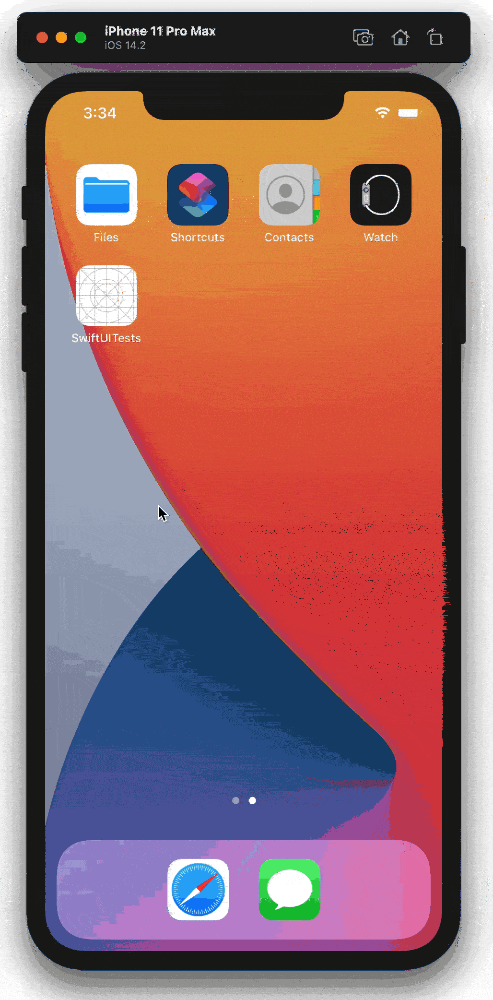

# ⛓️ ResponderChain

Cross-platform first responder handling without subclassing views or making custom ViewRepresentables in SwiftUI

## Features

- **💡 Easy to use:** Get, set and resign first responder simply through an EnvironmentObject.
- **⏰ Time Saving:** If an underlying view can become first responder all you have to do is tag it; and it works!
- **👀 Insightful:** Gives insight in which views can become first responder.

## Overview

Create a ResponderChainReader or attach the ResponderChain as environmentObject.

```swift
ResponderChainReader { chain in
    // ...
}

// or

// This just wraps the Example view in a ResponderChainReader and attaches the ResponderChain as environmentObject
Example().withResponderChainEnvironmentObject()
```

Tag views that can become first responder.

```swift
TextField(...).responderTag("MyTextField")
```

Check tagged views that are currently available to become first responder.

```swift
chain.availableResponders.contains("MyList")
```

Make tagged views become first responder.

```swift
chain.firstResponder = "MyTextField"
chain.afterRetrying {
    if chain.firstResponder == nil {
        print("Failed")
    }
}
```
> **Note:** This is completely safe, if "MyTextField" was either not available to become first responder or it wasn't tagged properly; `chain.firstResponder` will become `nil`
> **Note 2:** In most cases setting the firstResponder will be synchronous and you do not have to wait for retrying, read more about it under #Retrying


Resign first responder.

```swift
chain.firstResponder = nil
```

## Retrying

ResponderChain 2.0.0 will retry to set the firstResponder if it hasn't received but expects to receive the underlying responder for the tagged SwiftUI view.

### Why is this needed

This is needed because SwiftUI calls onAppear before ViewRepresentables are inserted into the UIKit/AppKit hierarchy.

### How does this work

Runloop 1: onAppear and ViewRepresentable.updateView are called. At this point we let the ResponderChainReader know we expect to find a responder
Runloop 2: ViewRepresentable is inserted in UIKit/AppKit hierarchy so we look for the responder and update the State variable with the found responder.
Runloop 3: We send the found responder (if any) to the ResponderChainReader and let it know we no longer expect to find a responder.

When you set a new firtResponder that ResponderChain doesn't have a responder for yet it checks if it is expected to receive a responder for that tag. If true; the ResponderChain schedules a retry in the next runloop for a maximum of two runloops.

Use ResponderChain.afterRetrying to get a callback when it's done with this behaviour.

## Example

Attach the ResponderChain as environmentObject.

```swift
...
// In the SceneDelegate or ApplicationDelegate where you have access to the window:
let rootView = ResponderChainExample().environmentObject(ResponderChain(forWindow: window))

// SwiftUI only:
ResponderChainExample().withResponderChainForCurrentWindow()
...
```

**ResponderChainExample.swift**
```swift
struct ResponderChainExample: View {
    @EnvironmentObject var chain: ResponderChain
    
    var body: some View {
        VStack(spacing: 20) {
            // Show which view is first responder
            Text("Selected field: \(chain.firstResponder?.description ?? "Nothing selected")")
            
            // Some views that can become first responder
            TextField("0", text: .constant(""), onCommit: { chain.firstResponder = "1" }).responderTag("0")
            TextField("1", text: .constant(""), onCommit: { chain.firstResponder = "2" }).responderTag("1")
            TextField("2", text: .constant(""), onCommit: { chain.firstResponder = "3" }).responderTag("2")
            TextField("3", text: .constant(""), onCommit: { chain.firstResponder = nil }).responderTag("3")
            
            // Buttons to change first responder
            HStack {
                Button("Select 0", action: { chain.firstResponder = "0" })
                Button("Select 1", action: { chain.firstResponder = "1" })
                Button("Select 2", action: { chain.firstResponder = "2" })
                Button("Select 3", action: { chain.firstResponder = "3" })
            }
        }
        .padding()
        .onAppear {
            // Set first responder on appear
            DispatchQueue.main.async {
                chain.firstResponder = "0"
            }
        }
    }
}
```


